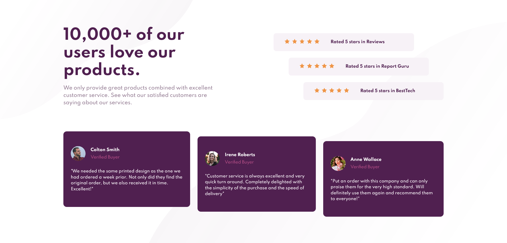

# Frontend Mentor - Social proof section solution

This is a solution to the [Social proof section challenge on Frontend Mentor](https://www.frontendmentor.io/challenges/social-proof-section-6e0qTv_bA). Frontend Mentor challenges help you improve your coding skills by building realistic projects.

## Table of contents

- [Overview](#overview)
  - [The challenge](#the-challenge)
  - [Screenshot](#screenshot)
  - [Links](#links)
- [My process](#my-process)
  - [Built with](#built-with)
  - [What I learned](#what-i-learned)
  - [Continued development](#continued-development)
  - [Useful resources](#useful-resources)
- [Author](#author)
- [Acknowledgments](#acknowledgments)

## Overview

### The challenge

Users should be able to:

- View the optimal layout for the section depending on their device's screen size

### Screenshot

### Links

- Solution URL: Coming Soon
- Live Site URL: Coming soon

## My process

### Built with

- Semantic HTML5 markup
- CSS custom properties
- Flexbox
- [React](https://reactjs.org/) - JS library
- [Next.js](https://nextjs.org/) - React framework

### What I learned

With this challenge I learned not to overcomplicate things (meaning I should've just built this using good old HTML and CSS, instead of NextJS).

### Continued development

I need to get better at NextJS and discerning when to use a javascript library/framework over basic HTML and CSS.

### Useful resources

- [How to detect window size in Next.js SSR using react hook?](https://stackoverflow.com/questions/63406435/how-to-detect-window-size-in-next-js-ssr-using-react-hook) - This helped me, as the title of the question suggests, how to detect window size in NextJS, which was more of a hassle than I anticipated.

## Author

- Frontend Mentor - [@fernandoLRibeiro](https://www.frontendmentor.io/profile/fernandoLRibeiro)
